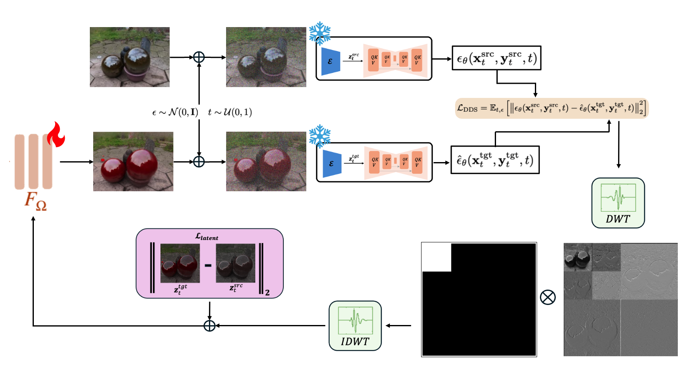

# Large-Scale 3D Scene Relighting using Pre‑Trained Diffusion Models

**COM507 – Optional Research Project in Communication Systems**  
**Author:** Efe Tarhan, MSc Student in Communication Systems  
**Supervisor:** Dongqing Wang, IVRL

---

<p align="center">
  
</p>

---

## 📁 Folder Structure

```
.
├── README.md
├── requirements.txt
├── assets/                          # Diagrams and logos
├── nerfstudio/3d_editing/dc_nerf/  # NeRF editing module
│   ├── data/                       # Custom datamanagers & parsers
│   ├── engine/                     # Trainer
│   ├── fields/                     # Fields used in models
│   ├── models/                     # Nerfacto/Splatfacto variants
│   └── pipelines/                  # Base + DC pipelines
├── dc/                             # Diffusion controller 
│   ├── dc.py, 
|   ├── cds.py                      # Main training logic
│   ├── dc_unet.py                  # FreeU UNet
│   └── utils/                      # Wavelet, image, FreeU utils
```

---

## ⚙️ Installation

First clone the repository 

```bash
git clone https://github.com/tarhanefe/ivrl-relight.git
cd ivrl-relight
```

Create a conda environment

```bash
conda create -n relight python=3.9
conda activate relight
```

Then, install the required packages.

```bash
pip install torch==2.1.2+cu118 torchvision==0.16.2+cu118 --extra-index-url https://download.pytorch.org/whl/cu118
pip install numpy==1.26.4
conda install -c "nvidia/label/cuda-11.8.0" cuda-toolkit
pip install ninja git+https://github.com/NVlabs/tiny-cuda-nn/#subdirectory=bindings/torch
pip install -e .
```
For 3D editing, you need to install the following packages.

```bash
cd 3d_editing
pip install -e .
pip install gsplat==0.1.6
pip install huggingface_hub==0.21.0
pip install tyro==0.6.6
```
---

## 📂 Dataset

You can access the dataset used for training and evaluation via the following link:  
🔗 [Google Drive Dataset](https://drive.google.com/drive/folders/1nO8yCE3YvK-gHqXteKokSjv4ujfTLX9c?usp=sharing)

Put the data folders under the ./3d_editing folder.

---

## 🚀 CLI Usage

### 🔧 Standard Command

```bash
ns-train dc   --data ./gardenspheres_n \
--load-dir ./outputs/gardenspheres_n/nerfacto/2025-03-30_013255/nerfstudio_models/ \
--pipeline.dc.src_prompt "a photo of two reflective spheres" \
--pipeline.dc.tgt_prompt "a photo of two reflective green spheres" \
--pipeline.dc.pipeline dc \
--pipeline.dc.guidance-scale 7.5 \
--vis viewer \
--max_num_iterations 3000   nerfstudio-data --downscale-factor 8
```

---

## 💡 Tips

| Flag                                | Description                                           |
|-------------------------------------|-------------------------------------------------------|
| `--pipeline.dc.src_prompt`          | Description of the original scene                    |
| `--pipeline.dc.tgt_prompt`          | Target scene description for relighting              |
| `--pipeline.dc.guidance-scale`      | Controls how strongly the text guides the edit       |
| `--pipeline.dc.wavelet_filtering`   | Enable/disable wavelet filtering                     |
| `--pipeline.dc.wavelet_name`        | Choose wavelet family (e.g., `haar`, `db2`, `sym4`)  |
| `--max_num_iterations`              | Max training steps                                   |
| `--load-dir`                        | Load pretrained NeRF checkpoint                      |

---
