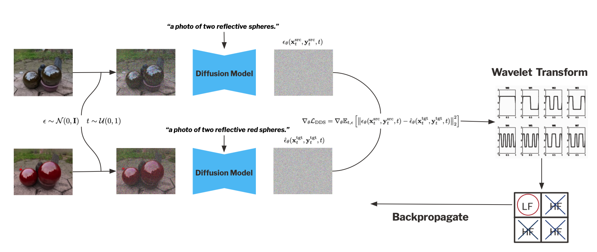

# Large-Scale 3D Scene Relighting using Pre‑Trained Diffusion Models

**COM507 – Optional Research Project in Communication Systems**  
**Author:** Efe Tarhan, MSc Student in Communication Systems 
**Supervisor:** Dongqing Wang, IVRL. 

---

  

## Table of Contents

1. [Project Overview](#project-overview)  
2. [Background](#background)  
   - [Score Distillation Sampling (SDS)](#score-distillation-sampling-sds)  
   - [Delta Denoising Score (DDS)](#delta-denoising-score-dds)  
   - [DreamCatalyst (2025)](#dreamcatalyst-2025)  
3. [Problem Definition](#problem-definition)  
4. [Methodology](#methodology)  
   - [Wavelet-Based Gradient Filtering](#wavelet-based-gradient-filtering)   
5. [Prerequisites](#prerequisites)  

---

## Project Overview

This research presents a novel technique for high‑quality, large‑scale 3D scene relighting by combining pre‑trained 2D diffusion models with a wavelet‑based gradient filtering approach. Our method preserves high‑frequency details—such as reflections on objects—while applying target relighting edits to Neural Radiance Fields (NeRFs).

---

## Background

### Score Distillation Sampling (SDS)
- Introduced in **DreamFusion** (Poole et al., ICLR 2023).
- Uses a frozen Stable Diffusion model; gradients are backpropagated only to the NeRF’s MLP.
- Allows text‑driven 3D generation but is not optimal for fine‑grained scene editing.

### Delta Denoising Score (DDS)
- Proposed by Hertz, Aberman & Cohen‑Or (ICCV 2023).
- Utilizes two identical Stable Diffusion models guided by a **source** and a **target** prompt.
- Computes the difference between their gradient updates, improving edit quality and reducing artifacts.

### DreamCatalyst (2025)
- Kim, Lee et al. (ICLR 2025).
- Builds on DDS by adding an identity‑preservation term:
  - Emphasizes identity at high noise (early timesteps).
  - Prioritizes editability at low noise (later timesteps).

---

## Problem Definition

Existing DDS‑based methods (including DreamCatalyst) tend to introduce edits across all frequency bands, causing loss of fine, high‑frequency details (e.g., reflections).  
**Objective:** Develop a robust relighting technique that preserves high‑frequency features in 3D scenes.

---

## Methodology

### Wavelet-Based Gradient Filtering

We propose decomposing the DDS gradient into low‑ and high‑frequency components via a discrete wavelet transform (DWT). Only the low‑frequency component is backpropagated during the relighting step:

  

---

### Prerequisites

- Python 3.8+  
- PyTorch 1.12+  
- NeRF framework of your choice (e.g., [instant-ngp](https://github.com/NVlabs/instant-ngp))  
- `diffusers` & `transformers` (Hugging Face)  
- `pywavelets` for DWT operations  

\`\`\`bash
pip install numpy==1.26.4
pip install gsplat==0.1.6
pip install huggingface_hub==0.21.0
pip install tyro==0.6.6
\`\`\`

